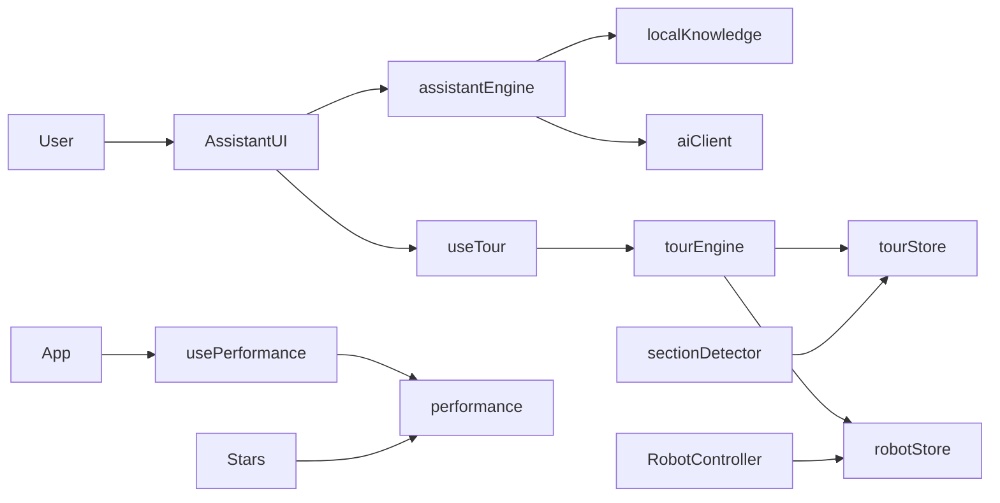

# Portfolio architecture (modular)

This document explains **why** each folder exists and how modules talk to each other.

## High-level flow



## Folder map

| Path | Purpose |
|------|---------|
| `src/config/` | Environment variables and feature flags |
| `src/utils/` | Pure helpers (debounce, device, easing) |
| `src/store/` | Zustand global state (tour, robot) |
| `src/ai/` | Assistant replies: local scripts → optional Grok |
| `src/tour/` | Guided tour config, scroll, section detection |
| `src/three/` | Shared R3F performance, lights, camera helpers |
| `src/robot/` | 3D robot (Phase 2 — stubs in Phase 1) |
| `src/hooks/` | React hooks bridging UI ↔ modules |
| `src/components/` | UI: assistant panel, bubbles, tour controls |

## React state vs Three.js

- **React state** (`useState` in `AssistantUI`, Zustand in stores): chat messages, tour step, which section is active.
- **Three.js** (`Canvas`, `useFrame`): runs outside React’s render cycle. Each frame, `useFrame` updates meshes; React only mounts the canvas once.
- **Bridge**: `usePerformance` sets `animationsPaused`; `Stars` checks `shouldRunAnimation()` inside `useFrame`.

## AI integration rules

1. `findLocalReply` — instant, no API.
2. `askGrok` — only if `REACT_APP_GROK_API_KEY` is set and local match failed.
3. Responses cached in memory; client rate limit per minute.

## Phases

- **Phase 1 (current)**: Folder structure, assistant UI, tour, performance pause, Docker/Netlify.
- **Phase 2**: Load compressed robot `.glb`, wire `RobotMovement` + `RobotAnimations`.
- **Phase 3**: Tailwind migration (optional), deeper canvas refactor.

## Netlify

Set environment variables in the Netlify UI (same names as `.env.example`). Build uses `netlify.toml`.

## Docker

```bash
docker compose up --build
# Open http://localhost:8080
```
